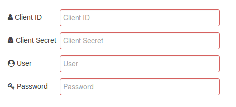
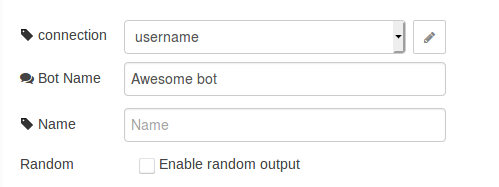
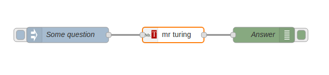

With **Mr. Turing** you can create awesome chatbots that can read documents, manuals, articles, etc. and make an understanding of what each piece of the document has to say. You can make a question like you do to another human.
Stop searching only with key words.

> This is the name of the key expected

## Credentials



You must create a user on <a target="blank" href="http://app.misterturing.com:8080/">this link</a> to fill the fields User and Password, the Client ID and Client Secret are provided by Data.H or partners.

## Choosing the Bot and the answer mode



After you've created your first bot and fed it with data you can now place its name here and do the questions that you want through the flow.

## Using the module is simples like this



First of all, you have a question coming into a json inside of the msg.payload then the question will be processed on the server so you will receive the response that you can do whatever you want to. You can find bellow the key expected.

```
{
   "question": "how can i use the Mr. Turing node-red module?"
}
```
